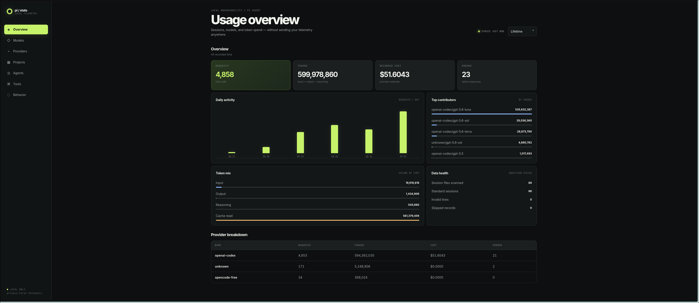

# pi-stats-dashboard

A local, privacy-first `/stats` dashboard for [Pi](https://pi.dev). It reads Pi's persisted JSONL sessions and opens a browser dashboard with lifetime, today, 7-day, and 30-day usage.

[GitHub repository](https://github.com/suryavamsi6/pi-stats-dashboard) · [npm package](https://www.npmjs.com/package/pi-stats-dashboard)

> Vendored into [Mieluoxxx/pi-ext](https://github.com/Mieluoxxx/pi-ext) from [suryavamsi6/pi-stats-dashboard](https://github.com/suryavamsi6/pi-stats-dashboard) @ `3ee97be` — package `v0.1.3` plus the unreleased dashboard change from that commit (_Show token usage categories separately_). Only `README.md`, `LICENSE`, `artifacts/`, `extensions/`, `src/`, and `test/` from upstream are tracked here; the upstream `flake.nix`/`flake.lock` NixOS packaging and GitHub Actions workflow are not.
>
> Local changes on top of upstream, both in `src/dashboard.html`: responsive layout fixes so panels, tables, and chart labels no longer overflow their container, and count abbreviation (`K`/`M`/`B`) instead of raw numbers.



## Install

From the monorepo root:

```bash
pi -e ./extensions/pi-stats-dashboard
```

Or install the published package:

```bash
pi install npm:@moguw/pi-stats-dashboard
```

Then run Pi and use `/stats`.

## Included metrics

- Input, output, reasoning, cache read/write, total tokens, recorded cost, requests, and errors
- Daily activity and breakdowns by model, provider, project, agent, and tool
- Local-only behavior counters for user messages: yelling, profanity, anguish, correction, repetition, and blame
- Malformed-record diagnostics

Costs are the values recorded by providers and may be zero or unavailable. They are estimates, not invoices. Pi does not persist reliable historical latency, TTFT, tokens/sec, or subscription-window data, so those are intentionally not fabricated.

The server binds to `127.0.0.1`, uses a random URL token, and returns aggregate data only. Prompt and response text is never retained or returned; behavior analysis happens in memory.

## Development

```bash
pi -e .
pnpm test
pnpm run check
pnpm pack --dry-run
```

This package intentionally uses Node built-ins and no runtime dependencies. The generated tarball is publish-ready; npm publication and repository creation are not automated.
